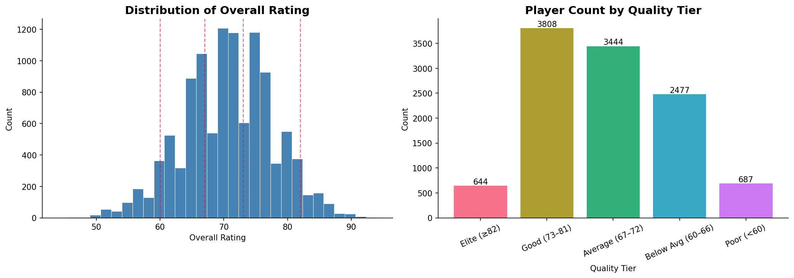
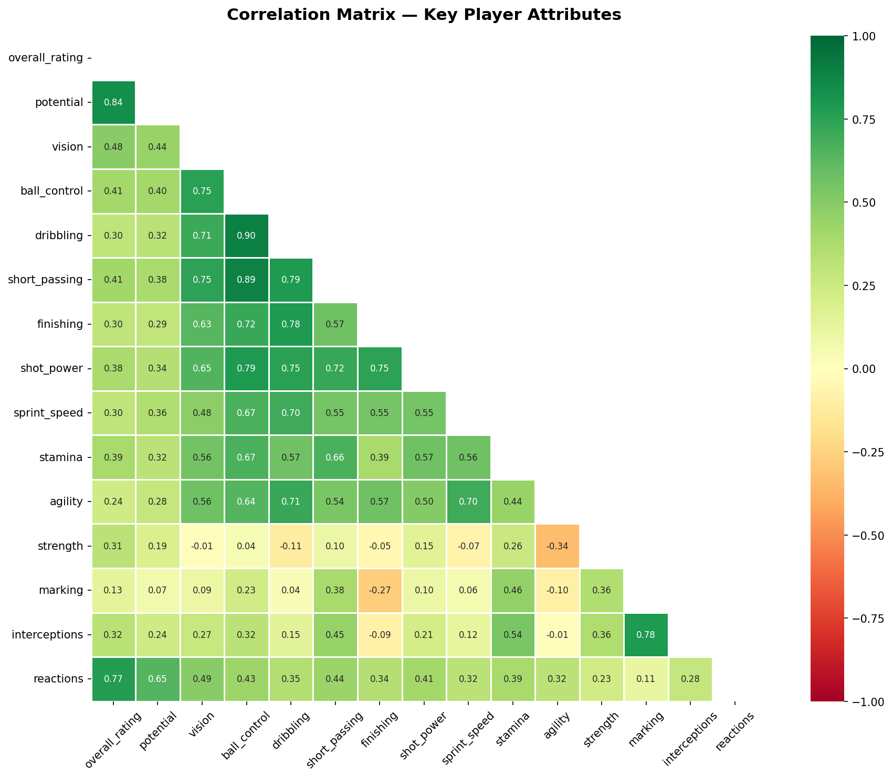
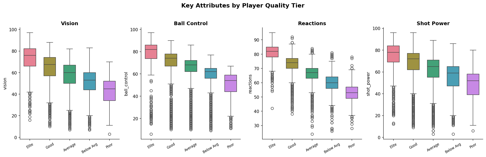
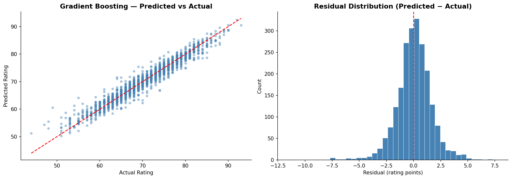
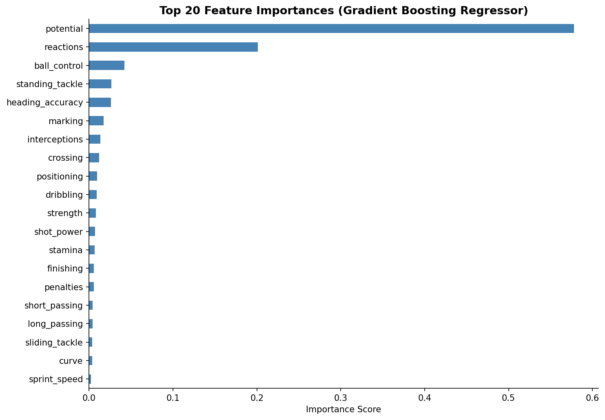
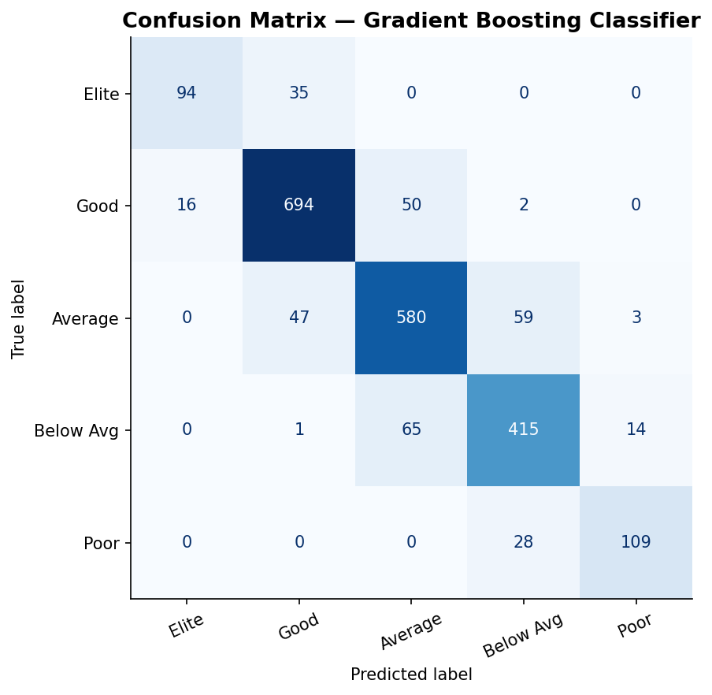

# ⚽ Predicting Soccer Player Ratings


Regression and multi-class classification models to predict FIFA-style soccer player ratings from 33 in-game attributes. Built using the [European Soccer Database](https://www.kaggle.com/datasets/hugomathien/soccer) (~11K unique players after deduplication).

---

## Table of Contents
- [Overview](#overview)
- [Dataset](#dataset)
- [Methodology](#methodology)
- [Results](#results)
- [Key Learnings & Improvements](#key-learnings--improvements)
- [Setup](#setup)
- [Project Structure](#project-structure)

---

## Overview

This project explores two predictive tasks on FIFA player attribute data:

1. **Regression** — predict a player's numerical overall rating (44–94 scale)
2. **Classification** — classify players into one of 5 quality tiers (Elite → Poor)

The project was originally built as an undergraduate data science capstone and later substantially revised with stronger modeling practices: cross-validation, regularization, macro F1 as the primary classification metric, and explicit overfitting analysis.

---

## Dataset

**Source:** [Kaggle — European Soccer Database](https://www.kaggle.com/datasets/hugomathien/soccer)  
**Table used:** `Player_Attributes.csv` (~184K rows, 42 columns)

The raw table contains ~7–8 season snapshots per player. To avoid data leakage and repeated observations, only the **peak-rated snapshot** per player is kept, resulting in **11,060 unique players**.

**Feature categories:**
- Technical (dribbling, ball control, crossing, finishing, etc.)
- Physical (sprint speed, stamina, strength, agility, jumping)
- Mental (vision, reactions, aggression, positioning)
- Work rate (categorical: low / medium / high)

**Quality Tier definitions (classification target):**

| Tier | Label | Rating Range | Players | % |
|------|-------|-------------|---------|---|
| 1 | Elite | ≥ 82 | 644 | 5.8% |
| 2 | Good | 73 – 81 | 3,808 | 34.4% |
| 3 | Average | 67 – 72 | 3,444 | 31.1% |
| 4 | Below Average | 60 – 66 | 2,477 | 22.4% |
| 5 | Poor | < 60 | 687 | 6.2% |



---

## Methodology

### Data Cleaning
- Deduplicated by keeping the highest-rated row per player (sort-then-deduplicate)
- Removed GK-specific attributes (`gk_diving`, `gk_handling`, etc.) — near-zero for outfield players
- Cleaned garbled work-rate values (`'stoc'`, `'le'`, `'y'` → `NaN`)
- Median imputation for numeric columns; mode imputation for categoricals

### Preprocessing Pipeline
- `StandardScaler` on all numeric features
- `OneHotEncoder` for categorical work-rate columns
- Pipeline fitted **only on training data** — test set transformed separately (no leakage)

### Train/Test Split
- **80/20 stratified split** (8,848 train / 2,212 test) — stratified on quality tier
- 5-fold cross-validation on training set to validate performance before touching the test set

### Models

**Regression:**
| Model | Notes |
|-------|-------|
| Linear Regression | Baseline |
| Ridge Regression | L2 regularization (α=10) |
| Gradient Boosting | 200 estimators, max_depth=4, lr=0.1 |

**Classification:**
| Model | Notes |
|-------|-------|
| Logistic Regression | Linear baseline, max_iter=1000 |
| K-Nearest Neighbors | k=7 |
| Decision Tree | max_depth=8, min_samples_leaf=10 |
| Random Forest | 200 trees, max_depth=10 |
| Gradient Boosting | 200 estimators, max_depth=4, lr=0.1 |
| Soft Voting Ensemble | LR + RF + GB combined |

### Evaluation Metrics
- **Regression:** R², RMSE, MAE, 5-fold CV R², % predictions within ±3 rating points
- **Classification:** Macro F1 (primary), per-class F1, accuracy, train/test gap (overfitting check)

> **Why macro F1 over accuracy?** With 5 unevenly sized classes, a naive model predicting "Average" every time would score ~31% accuracy. Macro F1 weights all classes equally, penalizing poor recall on the minority "Elite" tier.

---

## Exploratory Data Analysis

### Correlation Matrix

The heatmap below shows pairwise correlations across 15 key outfield attributes. `potential` and `reactions` are most strongly correlated with `overall_rating` (0.84 and 0.77 respectively). `dribbling` and `ball_control` share the strongest inter-feature correlation (0.90).



### Key Attributes by Quality Tier

Box plots confirm the ANOVA finding — vision, ball control, reactions, and shot power all shift clearly and consistently across tiers, giving classifiers strong separating signal.



---

## Results

### Regression

| Model | Test R² | CV R² (5-fold) | RMSE | MAE |
|-------|---------|----------------|------|-----|
| Linear Regression | 0.8240 | 0.8212 | 2.980 | 2.309 |
| Ridge Regression | 0.8240 | 0.8212 | 2.981 | 2.309 |
| **Gradient Boosting** | **0.9449** | **0.9379** | **1.667** | **1.205** |

Gradient Boosting predicts overall ratings with **93.2% of predictions landing within ±3 rating points**, and an average miss of just 1.2 points. The close agreement between test R² (0.9449) and CV R² (0.9379) confirms minimal overfitting.



### Feature Importance

`potential` dominates feature importance (as expected — FIFA scouts set it independently but it tracks closely with current rating). `reactions` is the strongest pure skill predictor, confirming the EDA finding.



### Classification

| Model | Train Macro F1 | Test Macro F1 | Test Accuracy | Overfit Gap |
|-------|---------------|---------------|---------------|-------------|
| Logistic Regression | 0.6787 | 0.6707 | 0.6980 | 0.0080 |
| K-Nearest Neighbors | 0.7966 | 0.7157 | 0.7473 | 0.0809 |
| Decision Tree | 0.7683 | 0.6750 | 0.7152 | 0.0933 |
| Random Forest | 0.8704 | 0.7929 | 0.8345 | 0.0775 |
| Gradient Boosting | 0.9878 | 0.8373 | 0.8553 | 0.1506 |
| **Soft Voting Ensemble** | **0.9353** | **0.8284** | **0.8495** | **0.1070** |

The Soft Voting Ensemble achieves **84.95% accuracy and 0.83 macro F1**. The hardest tier to classify is "Elite" (F1=0.79, recall=0.70) due to its small size — a strong candidate for SMOTE oversampling in future work.

> Note: Random Forest generalizes more reliably than Gradient Boosting (overfit gap 0.08 vs 0.15), making it the safer choice if minimizing overfitting is the priority.



---

## Key Learnings & Improvements

This project was originally built as an undergraduate capstone. The revised version addresses several data science anti-patterns:

| Original Issue | Fix Applied |
|---------------|-------------|
| Accuracy as the only metric | Added macro F1, RMSE, MAE, R² |
| No overfitting analysis | Train vs. test gap reported for every model |
| No cross-validation | 5-fold CV on training set for all regression models |
| Hard voting on 7 classifiers | Soft voting on top 3 calibrated models |
| Mean imputation for all nulls | Median imputation for numeric (robust to skew) |
| Decision Tree without regularization | Added `max_depth` and `min_samples_leaf` |
| GK attributes included for outfield model | Dropped all `gk_*` columns |
| Garbled work-rate values silently kept | Cleaned to NaN before encoding |
| Raw HTML in notebook markdown cells | Clean Markdown throughout |
| No feature importance analysis | GBM feature importances visualized |

---

## Setup

```bash
git clone https://github.com/goel-mehul/Predicting-Soccer-Player-Ratings.git
cd Predicting-Soccer-Player-Ratings
pip install -r requirements.txt
jupyter notebook Predicting_Soccer_Player_Ratings.ipynb
```

Download `Player_Attributes.csv` from the [Kaggle dataset](https://www.kaggle.com/datasets/hugomathien/soccer) and place it in the `Data/` directory.

---

## Project Structure

```
Predicting-Soccer-Player-Ratings/
├── Data/
│   └── Player_Attributes.csv        # Raw dataset (download from Kaggle)
├── Images/
│   ├── rating_distribution.png
│   ├── correlation_matrix.png
│   ├── tier_boxplots.png
│   ├── regression_results.png
│   ├── feature_importance.png
│   └── confusion_matrix.png
├── Predicting_Soccer_Player_Ratings.ipynb
├── requirements.txt
└── README.md
```

---

## Future Work

- Separate GK-only model using the `gk_*` attribute columns
- Apply SMOTE or cost-sensitive learning to improve recall on "Elite" (currently F1=0.79, recall=0.70)
- Hyperparameter tuning via `Optuna` to close Gradient Boosting's 0.15 overfit gap
- SHAP values for interpretable feature attribution on individual player predictions
- Incorporate match-level and team-level features from other tables in the database
- Deploy as a rating prediction API using FastAPI
